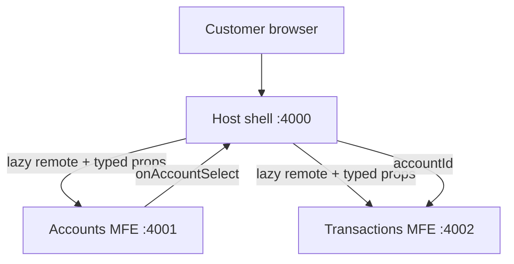

# FinFlow Micro Frontend Banking Dashboard

FinFlow is a React and TypeScript banking dashboard demonstrating domain-oriented micro frontends with runtime composition through Vite Module Federation.

## Architecture



| Application | Responsibility | Federation contract |
| --- | --- | --- |
| `host-app` | Composition, navigation, customer context and failure boundaries | Consumes both remotes |
| `accounts-mfe` | Account summaries and account selection | Exposes `./AccountsApp` |
| `transactions-mfe` | Searchable and status-filtered account activity | Exposes `./TransactionsApp` |

The host owns the minimal cross-domain state (`selectedAccountId`). Communication uses explicit typed props and callbacks, keeping the remotes independent from one another. Each remote has its own build and deployment boundary. React and React DOM are shared to avoid duplicate framework runtimes.

## Key capabilities

- Runtime composition through `remoteEntry.js`
- Lazy remote loading with dedicated `Suspense` states
- Independent error boundaries for remote-failure isolation
- Typed host-to-remote contracts
- Account context passed without direct remote-to-remote coupling
- Searchable and status-filtered transaction activity
- Responsive and keyboard-accessible controls
- Environment-specific remote locations

## Technology

- React 19 and TypeScript
- Vite 6
- `@originjs/vite-plugin-federation`
- CSS with domain-prefixed class names
- ESLint

Vite is pinned to version 6 because the selected federation plugin is not compatible with Vite 8's Rolldown-generated CSS metadata.

## Running locally

Prerequisites: Node.js 20+ and npm.

From the repository root:

```bash
npm run install:all
npm run demo
```

Open <http://127.0.0.1:4000>. The demo command builds all three applications and starts their production preview servers. Press `Ctrl+C` to stop them.

Default ports:

| Application | Port |
| --- | ---: |
| Host | 4000 |
| Accounts | 4001 |
| Transactions | 4002 |

## Commands

```bash
npm run build
npm run lint
npm run demo
```

Each application can also be built and served independently:

```bash
cd accounts-mfe
npm run build
npm run preview
```

## Environment configuration

The host resolves remote locations from environment variables. Copy `host-app/.env.example` to an appropriate `.env` file when the URLs differ:

```env
VITE_ACCOUNTS_REMOTE_URL=http://127.0.0.1:4001/assets/remoteEntry.js
VITE_TRANSACTIONS_REMOTE_URL=http://127.0.0.1:4002/assets/remoteEntry.js
```

Only `.env.example` should be committed. Local environment files are ignored.

## State and communication

The Accounts remote reports account selection through `onAccountSelect`. The host stores the selected identifier and passes it to the Transactions remote as `accountId`. This keeps both remotes unaware of one another while allowing the host to coordinate shared page context.

## Resilience

Each remote is wrapped in a dedicated loading state and error boundary. A remote import or render failure is contained within that domain, allowing the host and unaffected remotes to remain operational.

## Production considerations

The current implementation uses local mock data. A production banking platform would integrate authenticated APIs through a backend-for-frontend or gateway. Backend services would remain authoritative for authorization, balances and transaction state. Additional controls would include idempotency keys for transfers, audit events, step-up authentication, CSP, remote allowlists, telemetry, contract tests and controlled deployment rollback.
